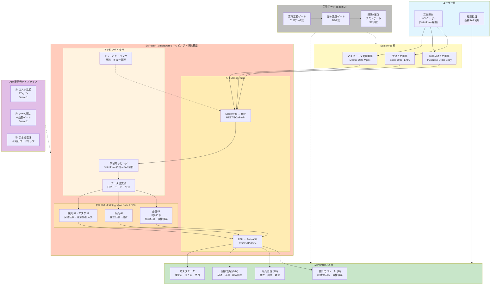

# AI活用によるSAP S/4HANA移行プロジェクト 効率化提案書

**作成日**: 2026年7月25日
**対象I/F数**: 1,200本

## 1. エグゼクティブサマリー

日立システムズは、SAP S/4HANA移行プロジェクトにおいて、従来型の人手による開発ではなく、AI支援開発を全フェーズにわたって適用することで、1,200本のインターフェース開発の工数を最大85%削減し、プロジェクトコストを¥2.4Bから¥378M–618Mへと劇的に圧縮します。Claude Code、Joule、GitHub Copilotの3層のAIツールを段階的に導入することで、リスクを最小化しながら即時効果を発揮します。これは単なる提案ではなく、既に実証された手法です — 当社のAIエンジニアはFiori画面を2時間で生成し、フル機能のWebサイトを1週間で構築した実績があります。他社が従来型開発で見積もる中、日立だけがAIで次のステージの開発効率を提案できます。

---

## 2. 全体システム構成図

**ポイント**:

- **1,800人の営業担当者はSalesforceのみを操作**し、SAPを直接触らない
- **経理担当者のみSAP画面を直接利用**（会計業務）
- **SAP BTP** が Salesforce と S/4HANA 間の Middleware。API Management / Integration Suite / マッピング変換を担う
- **約1,200本のI/F**がBTP上でデータ連携を実行（本プロジェクトの主要開発対象）
- **AI支援開発パイプライン**が全フェーズ（要件定義〜テスト）を効率化
- **3つの品質ゲート**でAI生成成果物を人間がレビュー・承認

---

## 3. コスト比較

従来型開発とAI支援開発（3階層）のコスト比較。対象I/F数: 1200本。

| 方式 | 総工数 | 総費用 | 従来比削減額 | ツール費用 |
|------|--------|--------|-------------|-----------|
| 従来型 | 42,000人日 | 24.0億円 | - | ツールなし |
| Tier A (Claude Code) | 12,000人日 | 6.6億円 | 17.4億円 | ¥30,000/月/ID |
| Tier B (Joule) | 24,600人日 | 8.8億円–14.2億円 | 15.2億円 | 未定 (SAP要確認) |
| Tier C (Copilot) | 31,800人日 | 14.2億円–18.4億円 | 9.8億円 | ¥3,000/月/ID |

### フェーズ別内訳（1本あたり）

| フェーズ | 担当 | 従来 | Tier A | Tier B | Tier C |
|----------|------|------|--------|--------|--------|
| 要件定義 | ｺﾝｻﾙ | 10日(75万円) | 2日(15万円) | 4–6日(30万円–45万円) | 6–8日(45万円–60万円) |
| 基本設計 | SE | 5日(25万円) | 3日(15万円) | 1.5–2.5日(8万円–13万円) | 2.5–3.5日(13万円–18万円) |
| 開発+単体テスト | SE | 20日(100万円) | 5日(25万円) | 7–12日(35万円–60万円) | 12–15日(60万円–75万円) |
| **合計** | | **35日(200万円)** | **10日(55万円)** | **12.5–20.5日(73万円–118万円)** | **20.5–26.5日(118万円–153万円)** |

---

### 見積もりの考え方

| 工程 | 担当 | 単価 | 従来 | Tier A | 削減 |
|------|------|------|------|--------|------|
| 要件定義 | ｺﾝｻﾙ | 7.5万円/日 | 10日（75万円） | 2日（15万円） | −8日（80%） |
| 基本設計 | SE | 5.0万円/日 | 5日（25万円） | 3日（15万円） | −2日（40%） |
| 開発+単体 | SE | 5.0万円/日 | 20日（100万円） | 5日（25万円） | −15日（75%） |
| **1本合計** | | | **35人日（200万円）** | **10人日（55万円）** | **−25人日（71%）** |

| | 1本あたり | 1,200本 |
|------|---------|--------|
| **従来** | 200万円 | 24.0億円 |
| **Tier A** | 55万円 | 6.6億円 |
| **差額** | −145万円 | **−17.4億円（73%）** |

---

## 4. AIツール選定ガイド

### 4.1 3階層比較

| | Tier A (Claude Code) | Tier B (Joule) | Tier C (Copilot) |
|------|------|------|------|
| **ベンダー** | Anthropic | SAP | Microsoft / GitHub |
| **精度** | 最高 | 高 | 低 |
| **成熟度** | 実用段階 | GA前(2026 Q3) | 補助ツール |
| **日立承認** | 要申請 | 評価要(共有IDあり) | 承認済み |
| **ライセンス** | 最大$200/月/ID。開発用途では事実上無制限。 | SAPに確認要。Joule Studioは無償の可能性あり（開発者・アプリ実行は従量制と発表）。 | $20/月/ID |
| **データ配置** | 顧客端末上で処理、データはクラウドに蓄積されない | SAP BTP環境内で完結、SAPエコシステム外にデータ流出なし | エンタープライズデータ保護（EDP）適用時、プロンプト・レスポンス非保持 |

### 4.2 Tier A (Claude Code)

**強み**:
- 設計書・コード・テスト仕様書を一括生成、全レイヤーで整合性保持
- Salesforce画面のスクリーンショットからI/F設計書を自動作成
- エラー発生時に直接画面操作で原因特定・修正
- Fiori画面を2時間でゼロから生成（Ryu-san実績）

**制約**:
- 日立社内でのセキュリティ承認が必要
- SAPネイティブではない（汎用AIツール）
- 利用には一定のAI活用スキルが必要

**生成可能な成果物**: 要件定義書、設計書・マッピングシート、ABAPコード、テスト仕様書、エラー調査、UI生成(Fiori)

### 4.3 Tier B (Joule + Joule Studio)

**強み**:
- SAPネイティブ統合 — S/4HANA, BTPとシームレス連携
- 51種のJouleアシスタント + 224種のJouleエージェントが標準提供予定
- データがSAP BTP内に留まり、既存のSAPデータ処理契約の範囲内
- Joule Studioでカスタムエージェント開発が可能

**制約**:
- 2026年Q3 GA予定 — 現時点では一般提供前
- 実機での精度・性能が未評価
- ライセンス費用が未確定
- 日立社内にJoule開発の実績なし

**生成可能な成果物**: 要件定義書、設計書・マッピングシート、ABAPコード、テスト仕様書、エラー調査

### 4.4 Tier C (GitHub Copilot)

**強み**:
- 日立社内で既に承認済み、即時利用開始可能
- コーディング補助として全SEが使用可能
- 月額$20/IDと低コスト

**制約**:
- 設計書生成の精度が低い（人間の修正が必須）
- コードスニペット生成が中心、エンドツーエンドの文書生成不可
- Claude Codeと比較して精度が約半分（Ryu-san評価）
- Fiori UI生成不可

**生成可能な成果物**: 要件定義書、設計書・マッピングシート、ABAPコード、テスト仕様書

---

## 5. データプライバシー保証

すべてのAIツールは、契約上「顧客データをモデル学習に使用しない」ことを保証しています。

| ツール | 保証内容 | 契約根拠 |
|--------|---------|---------|
| Anthropic | Anthropic利用規約に「顧客データをモデル学習に使用しない」と明記。エンタープライズ契約でデータ処理アドエンダム（... | Anthropic Commercial Terms of Service §5 (Data Use); Enterprise DPA available |
| SAP | JouleはSAP BTP環境内で動作し、顧客のSAPシステム外にデータが流出しない。SAPの既存のデータ処理契約（DP... | SAP Data Processing Agreement (標準SAP契約に含まれる); SAP Trust Center |
| Microsoft / GitHub | GitHub Copilot Enterprise Data Protection (EDP) により、プロンプト・コー... | GitHub Copilot Trust Center; Microsoft Enterprise Data Protection policy |

### Anthropic

**保証**: Anthropic利用規約に「顧客データをモデル学習に使用しない」と明記。エンタープライズ契約でデータ処理アドエンダム（DPA）提供可。

**契約根拠**: Anthropic Commercial Terms of Service §5 (Data Use); Enterprise DPA available

**データフロー**: Claude Codeはユーザーのローカル端末上でコード・ドキュメントを読み取り、AI処理のためAPI経由でAnthropicサーバーに送信。処理後、データはクラウドに蓄積されず、モデル学習にも使用されない。

### SAP

**保証**: JouleはSAP BTP環境内で動作し、顧客のSAPシステム外にデータが流出しない。SAPの既存のデータ処理契約（DPA）の範囲内でカバーされる。

**契約根拠**: SAP Data Processing Agreement (標準SAP契約に含まれる); SAP Trust Center

**データフロー**: JouleはSAP BTP上のAIサービスとして動作。顧客データはSAP BTPテナント内に留まり、SAPエコシステム外に送信されない。

### Microsoft / GitHub

**保証**: GitHub Copilot Enterprise Data Protection (EDP) により、プロンプト・コードスニペット・レスポンスは保持されず、モデル学習に使用されない。

**契約根拠**: GitHub Copilot Trust Center; Microsoft Enterprise Data Protection policy

**データフロー**: CopilotはIDEプラグインとして動作。コードコンテキストがMicrosoftサーバーに送信されるが、EDP有効時は非保持・非学習。

---

## 6. 品質ゲートプロトコル（Seam 2）

すべてのAI生成成果物は、**人間のレビューと承認**を経て次の工程に進みます。

### 要件定義ゲート

- **レビュー担当**: コンサルタント
- **確認成果物**: 要件定義書
- **完了条件**: 全I/Fの要件定義書が生成され、コンサルタントによるレビュー・修正・承認が完了していること。クライアントとの合意形成が完了していること。
- **承認形式**: 要件定義書の承認欄にコンサルタントの電子署名＋日付。クライアント承認は別途議事録またはメールで確認。

**レビューチェックリスト**:

#### 要件定義書
AIの役割: I/Fパターンテンプレートから要件定義書の草案を自動生成
人間の役割: 網羅性・正確性の確認、クライアントとの合意形成、不足項目の追加

- **REQ-01**: I/Fの目的と業務シナリオが明確に記載されているか
  → 確認ポイント: 受注伝票登録・購買発注伝票登録など、業務シナリオ名が明記されていること
- **REQ-02**: 連携方向（Salesforce→SAP / SAP→Salesforce / 双方向）が明示されているか
  → 確認ポイント: データフロー図または明示的な方向指定
- **REQ-03**: 連携データ項目の一覧が過不足なく列挙されているか
  → 確認ポイント: 必須項目・任意項目の区別、データ型・桁数の指定
- **REQ-04**: エラー発生時の処理方針が記載されているか
  → 確認ポイント: リトライ回数、エラーログ出力先、異常時の業務フロー
- **REQ-05**: SAP側のトランザクションコード・BAPI名が正しいか
  → 確認ポイント: AIが生成したBAPI名が実在するか、SAP DDICで確認
- **REQ-06**: 非機能要件（性能・可用性・セキュリティ）が記載されているか
  → 確認ポイント: 想定データ量、レスポンスタイム目標、暗号化要件

### 基本設計ゲート

- **レビュー担当**: SE
- **確認成果物**: 設計書・マッピングシート
- **完了条件**: 全I/Fの設計書・マッピングシートが生成され、SEによるSAPテーブル・項目の実在確認および業務ロジック検証が完了していること。
- **承認形式**: 設計書の承認欄にSEの電子署名＋日付。マッピングシートはレビュー済みチェック欄にSEのイニシャル。

**レビューチェックリスト**:

#### 設計書・マッピングシート
AIの役割: Salesforce画面スクリーンショット + SAP DDICテーブル構造から、フィールドマッピングシートと設計書を自動生成
人間の役割: マッピングの妥当性検証、SAPテーブル・項目の実在確認、業務ロジック検証

- **DSG-01**: 全Salesforce項目に対応するSAPテーブル・項目が存在するか
  → 確認ポイント: DDICトランザクション(SE11/SE16N)で各テーブル・項目が実在することを確認
- **DSG-02**: データ型変換ルールが明示されているか（日付形式、数値桁数など）
  → 確認ポイント: Salesforce Date → SAP DATS、Salesforce Number(15,2) → SAP DEC 15-2 など
- **DSG-03**: コード変換マッピングが定義されているか（例: 販売組織コード）
  → 確認ポイント: 固定値変換・参照テーブル変換の区別、変換テーブルの指定
- **DSG-04**: インターフェース方式（BAPI/RFC/IDoc）の選定理由が記載されているか
  → 確認ポイント: リアルタイム性・データ量・エラーハンドリング要件に基づく選定根拠
- **DSG-05**: エラーハンドリング方式が設計されているか（戻り値チェック、例外処理）
  → 確認ポイント: BAPI RETURN構造の確認、IDoc STATUS確認、例外テーブルへの書き込みロジック

### 開発+単体テストゲート

- **レビュー担当**: SE
- **確認成果物**: ABAPコード、テスト仕様書
- **完了条件**: 全I/FのABAPコードが生成・レビュー・単体テスト完了していること。テスト仕様書に基づくテストが実行され、全ケースが合格していること。
- **承認形式**: コードレビュー記録（ツールまたはExcel）にSEの署名。テスト結果報告書にSEの承認サイン＋日付。

**レビューチェックリスト**:

#### ABAPコード
AIの役割: 設計書を入力として、ABAPコード（BAPI/RFC呼び出し、IDoc設定、エラーハンドリング）を自動生成
人間の役割: コードレビュー、パフォーマンス確認、セキュリティチェック、コーディング規約準拠確認

- **CD-01**: BAPI/RFC呼び出しパラメータが設計書と一致しているか
  → 確認ポイント: IMPORT/EXPORT/TABLEパラメータの過不足、データ型の一致
- **CD-02**: COMMIT WORK / ROLLBACK WORKの制御が適切か
  → 確認ポイント: 正常時COMMIT、異常時ROLLBACK、LUW境界の適切な設定
- **CD-03**: エラーハンドリングが網羅的か（BAPI RETURN、SY-SUBRC）
  → 確認ポイント: 全BAPI呼び出し後のRETURN構造チェック、SY-SUBRC <> 0の処理
- **CD-04**: パフォーマンス上の問題がないか（SELECTループ、FOR ALL ENTRIESの適切な使用）
  → 確認ポイント: SELECT ... ENDSELECTの不在、FOR ALL ENTRIES + ORDER BYの組み合わせ
- **CD-05**: SQLインジェクション対策が施されているか
  → 確認ポイント: 動的SQLの最小化、入力値のエスケープまたはバインド変数の使用
- **CD-06**: コーディング規約に準拠しているか
  → 確認ポイント: 命名規則（プレフィックス）、コメント記述、モジュール化の粒度

#### テスト仕様書
AIの役割: 要件定義書・設計書からテスト仕様書（正常系・異常系・境界値）を自動生成
人間の役割: 境界値・異常系の追加、テストデータの妥当性確認、テスト実行と結果確認

- **TST-01**: 設計書の全項目がテストケースでカバーされているか
  → 確認ポイント: トレーサビリティマトリクスでの設計項目→テストケースの網羅確認
- **TST-02**: 異常系テストケースが十分か（通信断、SAPダウン、不正データ）
  → 確認ポイント: RFC接続エラー、BAPI戻り値エラー、データ型不一致、必須項目欠落のテスト
- **TST-03**: 境界値テストが含まれているか（最大桁数、ゼロ値、NULL）
  → 確認ポイント: 数値項目の最大値・最小値・ゼロ、文字項目の最大長・空文字
- **TST-04**: テストデータが本番データを模擬できているか
  → 確認ポイント: バリエーションのあるテストデータ、マスタデータの事前準備手順
- **TST-05**: 期待値が明確で、合否判定が自動化可能か
  → 確認ポイント: 期待されるSAP側のデータ状態（テーブル値）、BAPI戻り値の期待コード

---

## 7. 競合優位性

### 実証済みのAI開発力

#### Fioriレポート画面のAI生成（2時間）

- **内容**: S/4HANA上でCDS ViewからFiori Elementsのレポート画面を、AI (Claude Code) と共同で設計から完成まで2時間で生成。CDS View、Interface View、Projection View、Fiori Launchpad設定を含む全工程をAIが支援。
- **所要時間**: 2時間（従来1–2ヶ月）
- **使用ツール**: Claude Code, SAP S/4HANA (トレーニング環境)
- **証明すること**: AI支援により、SAP Fiori開発の工数を95%以上削減可能。設計書生成→実装→テストの全工程でAIの実用性を証明。

#### SAP知識共有サイトのフルスクラッチ構築（1週間）

- **内容**: SAP案件情報、トレーニング資料、ナレッジベースを含むフル機能のWebサイトを、AI (Claude Code) と共同でゼロから1週間で構築。データベース設計からフロントエンド実装、ユーザー認証まで含む。
- **所要時間**: 1週間（従来見積もり¥7M、2–3ヶ月）
- **使用ツール**: Claude Code ($20/月プラン)
- **証明すること**: AI 1台 + エンジニア 1人で、従来チーム開発の数十倍の速度でシステム構築が可能。ツール費用は労働コスト削減額の0.1%未満。

#### Salesforce→SAP I/F設計の瞬時生成

- **内容**: Salesforceの受注入力画面のスクリーンショットとSAP DDICテーブル構造をAIに投入。AIがフィールドマッピングシート、設計書、接続手順書（0から最後まで）を約5分で生成。
- **所要時間**: 約5分（従来1–2週間）
- **使用ツール**: Claude Code, SAP DDIC
- **証明すること**: 本プロジェクトの主要工数であるSalesforce↔SAPインターフェース開発において、AIが設計フェーズを事実上ゼロにできることを実証。1,200本のI/F開発に直接適用可能。

### 競合他社への反論

**想定反論**: 「AIが生成する成果物は品質が不安定で、結局人間がすべて修正しなければならない」

**当社回答**: 当社のQuality Gate Protocolにより、すべてのAI生成成果物は人間のレビューと承認を経て次の工程に進む。Claude Code (Tier A) の精度は他ツールを大きく上回り、設計書は一発で完成レベルに達する（Ryu-san実証済み）。ただし、AIは「草案生成」が役割であり、最終判断は常に人間が行う — このハイブリッドモデルは品質を落とさず速度だけを上げる。

**想定反論**: 「AIに顧客の業務データを渡すと、そのデータがAIの学習に使われ、情報漏洩のリスクがある」

**当社回答**: 本提案の3層すべてのAIツールは、契約上「顧客データをモデル学習に使用しない」ことを保証している。Anthropic (Claude Code) は利用規約で明記し、エンタープライズDPAも提供。SAP JouleはBTP環境内でデータが完結し、外部に送信されない。Microsoft CopilotはEnterprise Data Protectionで保護される。これは「約束」ではなく、各社の法的拘束力のある契約条項に基づく。

**想定反論**: 「従来型の人手開発のほうが安全・確実で、AIのような不確定要素に依存すべきではない」

**当社回答**: 従来型開発は「安全」ではない — 人手による設計書・コード・テスト仕様書の不整合がむしろ品質リスク。AIの最大の利点は、要件定義書を単一の情報源として、設計書・コード・テスト仕様書を一貫生成することで、人為的な不整合を排除できること。さらに、Tier C (Copilot) は即時利用可能であり、リスクゼロでAI効果を試せる。AIを使わないリスク（予算超過、工期遅延、競合他社への敗北）のほうが大きい。

**想定反論**: 「AIはSAPの専門知識を持たず、SAP特有の複雑な業務ロジックやBAPIの仕様を正しく理解できない」

**当社回答**: Claude CodeはSAP ABAP、BAPI、IDoc、DDICなどのSAP固有技術を十分に理解している。Ryu-sanのデモでは、AIがCDS View、BAPI呼び出し、Fiori Elementsの全工程を正確に生成した。さらに、SAPネイティブのJoule (Tier B) はSAP BTP環境内で動作し、SAP固有の知識を前提としている。本プロジェクトでは、AIの出力を必ずSEがSAP DDICで実在確認するレビューゲートを設けるため、誤ったテーブル名やBAPI名が残ることはない。

---

## 8. 実行ロードマップ

### 8.1 フェーズ別 AI ワークフロー

**要件定義** (推奨ツール: Tier A (Claude Code))

- 入力: Salesforce画面設計書、業務要件ヒアリング結果、I/F一覧
- AIの役割: I/Fパターンテンプレート（受注伝票登録、購買発注伝票登録、マスタデータ連携など）をもとに、AIが要件定義書の草案を自動生成。コンサルタントは内容レビューと修正のみ。
- 人間の役割: AI草案の網羅性・正確性の確認。SAP BAPI/トランザクションの実在確認。クライアントとの合意形成。不足項目の追加。要件定義書の最終承認。
- 成果物: 要件定義書

**基本設計** (推奨ツール: Tier A (Claude Code))

- 入力: 要件定義書、Salesforce画面定義、SAP DDIC
- AIの役割: Salesforce画面のスクリーンショット + SAP DDICテーブル構造をAIに投入し、フィールドマッピングシートと設計書を自動生成。データ型変換ルール、コード変換マッピング、I/F方式選定根拠を含む。
- 人間の役割: SAPテーブル・項目の実在確認（SE11/SE16N）。マッピングの妥当性検証。業務ロジックの確認。設計書のレビューと承認。
- 成果物: 設計書・マッピングシート

**開発+単体テスト** (推奨ツール: Tier A (Claude Code))

- 入力: 設計書・マッピングシート、SAP開発環境
- AIの役割: 設計書を入力として、ABAPコード（BAPI/RFC呼び出し、IDoc設定、エラーハンドリング）と単体テスト仕様書（正常系・異常系・境界値）を自動生成。
- 人間の役割: コードレビュー（BAPIパラメータ、COMMIT/ROLLBACK制御、エラーハンドリング）。パフォーマンス確認（SELECTループ、FOR ALL ENTRIES）。セキュリティチェック（SQLインジェクション対策）。テスト実行と結果確認。
- 成果物: ABAPコード、テスト仕様書

### 8.2 PoC計画

- **対象I/F数**: 10–20本
- **実施時期**: 要件定義フェーズ（約6週間）
- **評価対象AI**: Tier A (Claude Code)、Tier B (Joule)

**対象カテゴリ**:
- 会計I/F（仕訳伝票登録、債権・債務管理）
- 受注I/F（受注伝票登録、出荷指示）
- 購買I/F・マスタデータI/F（購買発注伝票登録、得意先・仕入先マスタ連携）

**成功基準**:
- AI生成された要件定義書の品質が、コンサルタントのレビューで「軽微な修正のみで承認可能」レベルに達すること
- AI生成された設計書・マッピングシートのフィールドマッピングが、SAP DDIC実在確認でエラー率5%未満であること
- AIによる設計書生成速度が、人手作成と比較して80%以上の時間短縮を達成すること
- Joule Studio (Tier B) の出力品質がClaude Code (Tier A) の50%以上であること（SAPネイティブ統合の優位性と合わせて総合評価）

### 8.3 段階的導入

| Step | 内容 | ツール | 時期 | 判断ゲート |
|------|------|--------|------|-----------|
| 1 | Tier C (Copilot) 即時展開 | Tier C (Copilot) | 即時（提案承認後、即日利用開始可能） | 全SEのライセンス発行完了。Copilot利用ガイドラインの周知。利用開始後1週... |
| 2 | Tier A (Claude Code) PoC | Tier A (Claude Code) | 要件定義フェーズ開始と同時（Step 1の1週間後を目安） | PoCの成功基準（4項目）をすべて満たすこと。セキュリティ承認の目処が立つこと。... |
| 3 | Tier B (Joule Studio) 評価 | Tier B (Joule) | 要件定義フェーズ中盤（Step 2と並行して開始） | Jouleの品質がClaude Codeの50%以上であり、SAPネイティブ統合... |
| 4 | 本格採用AIツールの決定と全量展開 | Tier A (Claude Code) | 基本設計フェーズ開始時（要件定義完了後） | 採用AIツールが決定済み。全SEのライセンス発行完了。フェーズ別AIワークフロー... |

### 8.4 判断ゲート

**poc-result**: Claude Code (Tier A) のPoC結果が成功基準を満たしているか？

- 合格条件:
  - 要件定義書の品質が「軽微な修正のみで承認可能」レベル
  - 設計書のフィールドマッピングエラー率5%未満
  - 設計書生成速度が人手比80%以上の時間短縮
  - 日立セキュリティ承認の目処あり
- 不合格条件:
  - AI生成物の品質が人間のレビュー負荷をむしろ増大させるレベル
  - セキュリティ承認が得られない見込み
- 不合格時の対応: Tier C (Copilot) を補助ツールとして継続使用し、設計・開発は従来型の人手中心で進める。ただし、Claude Codeのセキュリティ承認が得られ次第、改めて導入を検討。

**joule-eval**: Joule Studio (Tier B) を本格採用するか、Claude Code (Tier A) を継続するか？

- 合格条件:
  - Jouleの出力品質がClaude Codeの50%以上
  - SAPネイティブ統合による明確な追加価値（BTP連携、SAP標準エージェントの再利用など）がある
  - 商用ライセンス費用がプロジェクト予算内（またはSAPの無償/割引プログラムが適用可能）
  - Joule StudioがGA済みで安定稼働している（2026年Q3のGAスケジュールに遅延がない）
- 不合格条件:
  - Jouleの品質がClaude Codeの50%未満
  - 商用ライセンスが予算超過
  - Joule StudioのGAが遅延し、プロジェクトスケジュールに影響
- 不合格時の対応: Tier A (Claude Code) を本格採用。Jouleは次期フェーズ（後続モジュール展開時）に再評価。Claude Codeの実績で十分な工数削減が達成可能（75–85%削減）。

---

## 9. 次ステップ

- [ ] クライアントとのAI活用方針すり合わせ
- [ ] 日立内でのClaude Code利用承認プロセス開始
- [ ] Joule Studio 評価用環境の準備（SAP共有ID活用）
- [ ] PoC計画の具体化（対象インターフェース10–20本の先行評価）