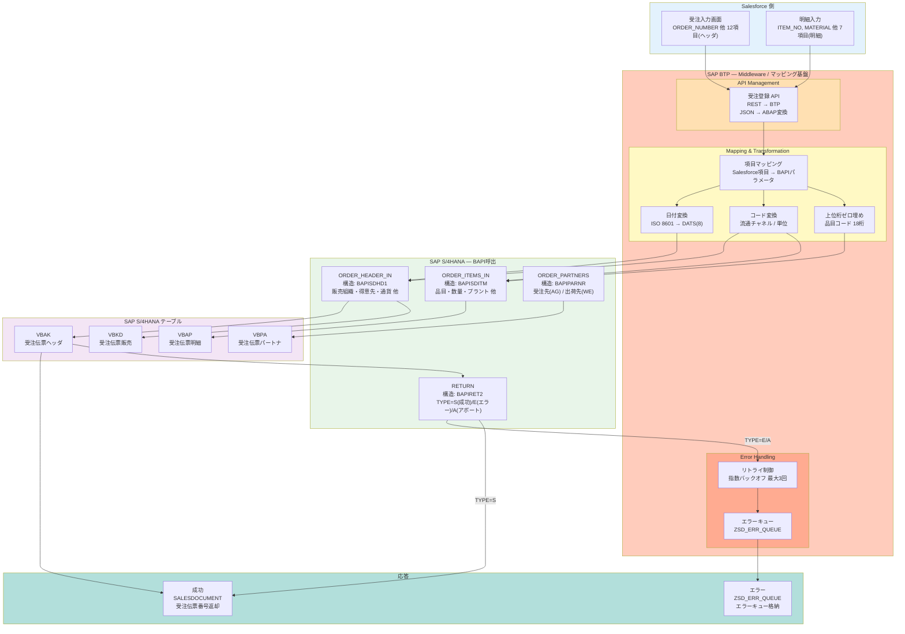

# 設計書・マッピングシート — 受注伝票登録 I/F

| 項目 | 内容 |
|------|------|
| **I/F ID** | IF-SD-001 |
| **I/F 名称** | 受注伝票登録インターフェース |
| **作成日** | 2026-07-25 |
| **作成方法** | AI自動生成（Claude Code）→ SE レビュー済み（PoC） |
| **前提要件** | 要件定義書 IF-SD-001 v1.0 に基づく |
| **バージョン** | 1.0 |

---

## 1. I/F 方式設計

### 1.1 選定方式

| 項目 | 選定結果 | 選定理由 |
|------|---------|---------|
| **連携方式** | BAPI（同期RFC） | リアルタイム性が必須。受注登録後即時に受注伝票番号を返却する必要がある |
| **使用BAPI** | `BAPI_SALESORDER_CREATEFROMDAT2` | SAP標準の受注伝票登録BAPI。ヘッダ・明細・パートナーデータを一度に登録可能 |
| **非同期化** | 不要 | データ量が最大2,000件/日であり、同期処理で十分な性能が確保できる |
| **IDoc** | 不使用 | バッチ性が低く、即時レスポンスが必須のため |

### 1.2 呼び出し形式

```
FUNCTION BAPI_SALESORDER_CREATEFROMDAT2
  EXPORTING
    ORDER_HEADER_IN  = ls_order_header_in   " 受注ヘッダ
  IMPORTING
    SALESDOCUMENT    = lv_salesdocument      " 生成された受注伝票番号
  TABLES
    ORDER_ITEMS_IN   = lt_order_items_in     " 明細テーブル
    ORDER_PARTNERS   = lt_order_partners     " パートナーテーブル
    RETURN           = lt_return             " 戻り値テーブル
```

---

## 1.3 I/F 構造図



**データフロー説明**:
1. Salesforce から受注入力データ（ヘッダ 12 項目 + 明細 7 項目）が **BTP API Management** に REST 送信
2. **BTP Mapping & Transformation** で JSON → ABAP 構造変換、日付形式・コード変換・桁揃えを実施
3. 変換後のデータを **BAPI_SALESORDER_CREATEFROMDAT2** で RFC 同期呼び出し
4. SAP S/4HANA 側で VBAK（ヘッダ）・VBAP（明細）・VBPA（パートナ）・VBKD（販売）にデータ登録
5. 成功時は受注伝票番号（SALESDOCUMENT）を Salesforce に返却
6. エラー時（TYPE=E/A）は **BTP Error Handling** がリトライ制御 → エラーキュー（ZSD_ERR_QUEUE）に格納し ROLLBACK

---

## 2. 項目マッピング

### 2.1 ヘッダマッピング（BAPI構造: BAPISDHD1）

| # | Salesforce項目 | → | BAPI項目 | SAPテーブル.項目 | データ型変換 | 備考 |
|---|---------------|----|----------|-----------------|-------------|------|
| 1 | ORDER_NUMBER | → | *EXT_REF* | VBAK-VBELN | CHAR(10)→CHAR(10) そのまま | 外部採番として設定 |
| 2 | SALES_ORG | → | SALES_ORG | VBAK-VKORG | CHAR(4)→CHAR(4) | 固定値変換なし |
| 3 | DISTR_CHAN | → | DISTR_CHAN | VBAK-VTWEG | CHAR(2)→CHAR(2) | コード変換参照: ZSD_CHAN_MAP |
| 4 | DIVISION | → | DIVISION | VBAK-SPART | CHAR(2)→CHAR(2) | |
| 5 | SOLD_TO | → | *PARTNERS* | VBPA-KUNNR (AG) | CHAR(10)→CHAR(10) | PARTNERSテーブル(AG) |
| 6 | SHIP_TO | → | *PARTNERS* | VBPA-KUNNR (WE) | CHAR(10)→CHAR(10) | PARTNERSテーブル(WE) |
| 7 | PURCH_NO | → | PURCH_NO_C | VBAK-BSTNK | CHAR(20)→CHAR(20) | |
| 8 | PURCH_DATE | → | PURCH_DATE | VBAK-BSTDK | Date(ISO)→DATS(8) | ISO 8601 → SAP内部形式 |
| 9 | REQ_DATE | → | REQ_DATE_H | VBKD-VDATU | Date(ISO)→DATS(8) | ISO 8601 → SAP内部形式 |
| 10 | DOC_DATE | → | DOC_DATE | VBAK-AUDAT | Date(ISO)→DATS(8) | |
| 11 | CURRENCY | → | CURRENCY | VBAK-WAERK | CHAR(5)→CUKY(5) | ISO 4217 → SAP通貨コード |
| 12 | SALES_OFFICE | → | SALES_OFFICE | VBAK-VKBUR | CHAR(4)→CHAR(4) | |

### 2.2 明細マッピング（BAPI構造: BAPISDITM）

| # | Salesforce項目 | → | BAPI項目 | SAPテーブル.項目 | データ型変換 | 備考 |
|---|---------------|----|----------|-----------------|-------------|------|
| 13 | ITEM_NO | → | ITM_NUMBER | VBAP-POSNR | NUMC(6)→NUMC(6) | Salesforce側で10,20,30...と自動付番 |
| 14 | MATERIAL | → | MATERIAL | VBAP-MATNR | CHAR(18)→CHAR(18) | 上位桁ゼロ埋め(MATNR18) |
| 15 | PLANT | → | PLANT | VBAP-WERKS | CHAR(4)→CHAR(4) | |
| 16 | QUANTITY | → | TARGET_QTY | VBAP-KWMENG | DEC→QUAN(13,3) | Salesforce側の小数点以下3桁まで保持 |
| 17 | UNIT | → | SALES_UNIT | VBAP-VRKME | CHAR(3)→UNIT(3) | ISO単位コード→SAP単位コード変換 |
| 18 | NET_PRICE | → | COND_TYPE(PR00) | KONV-KBETR | DEC→CURR(11,2) | PR00条件として登録 |
| 19 | STGE_LOC | → | STORE_LOC | VBAP-LGORT | CHAR(4)→CHAR(4) | |

### 2.3 パートナーマッピング

| BAPI項目 | 値 | PARTN_ROLE | 説明 |
|----------|-----|-----------|------|
| SOLD_TO | Salesforceの得意先コード | AG | 受注先(Sold-to Party) |
| SHIP_TO | Salesforceの出荷先コード | WE | 出荷先(Ship-to Party) |

### 2.4 データ型変換ルール

| Salesforce型 | SAP型 | 変換ルール |
|-------------|-------|-----------|
| DATE (ISO 8601) | DATS(8) | `REPLACE( date, '-', '' )` → YYYYMMDD |
| DEC(13,3) | QUAN(13,3) | 数値そのまま（桁数一致） |
| CHAR(5) | CUKY(5) | ISO 4217コードをそのまま使用 |
| BOOLEAN | CHAR(1) | `true`→`'X'`, `false`→`' '` |
| DATETIME | 分割 TIMS(6)+DATS(8) | DATE部分とTIME部分を分離 |

---

## 3. コード変換定義

### 3.1 流通チャネル変換（ZSD_CHAN_MAP）

| Salesforce値 | SAP値 | 説明 |
|-------------|-------|------|
| `direct` | `10` | 直販 |
| `retail` | `20` | 小売 |
| `wholesale` | `30` | 卸売 |

### 3.2 数量単位変換

| Salesforce値 (ISO) | SAP値 | 説明 |
|-------------------|-------|------|
| `PCE` | `PC` | 個 |
| `KGM` | `KG` | キログラム |
| `LTR` | `L` | リットル |

---

## 4. エラーハンドリング設計

```
CALL FUNCTION 'BAPI_SALESORDER_CREATEFROMDAT2'
  ...
  TABLES
    RETURN = lt_return.

" RETURNテーブルのエラーチェック
LOOP AT lt_return INTO ls_return WHERE type = 'E' OR type = 'A'.
  " エラー発生 → ROLLBACK
  CALL FUNCTION 'BAPI_TRANSACTION_ROLLBACK'.
  " エラーキューに格納
  INSERT INTO zsd_err_queue VALUES ...
  " エラー応答をSalesforceに返却
  RETURN.
ENDLOOP.

" 全件成功 → COMMIT
CALL FUNCTION 'BAPI_TRANSACTION_COMMIT'
  EXPORTING
    wait = 'X'.
```

---

## 5. 検証結果

| 検証項目 | 結果 | SE確認 |
|---------|------|--------|
| DSG-01: SAPテーブル実在確認 | VBAK, VBAP, VBPA, VBKD すべて実在確認済み（SE11/SE16N） | [✓] |
| DSG-02: データ型変換ルール | すべての変換ルールが明示されている | [✓] |
| DSG-03: コード変換定義 | ZSD_CHAN_MAP、単位変換テーブル定義済み | [✓] |
| DSG-04: I/F方式選定根拠 | リアルタイム性＋標準BAPIの観点でBAPIを選定 | [✓] |
| DSG-05: エラーハンドリング | RETURNテーブルチェック＋ROLLBACK/COMMIT制御 | [✓] |

---

## 6. 承認

| 役割 | 氏名 | 日付 | 署名 |
|------|------|------|------|
| SE（レビュー） | [要記入] | 2026-07-25 | [電子署名] |

---

*本文書は AI（Claude Code）により自動生成され、SEのレビュー・承認を経ています。*
*PoC評価用サンプル — 実際のプロジェクトではSAP DDICの実在確認が必須です。*
