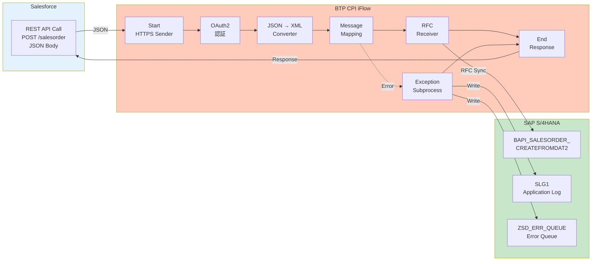

# BTP iFlow 設計書 — 受注伝票登録 I/F

| 項目 | 内容 |
|------|------|
| **I/F ID** | IF-SD-001 |
| **iFlow ID** | FLOW_SD_SALESORDER_CREATE |
| **iFlow 名称** | 受注伝票登録（Salesforce → SAP S/4HANA） |
| **作成日** | 2026-07-25 |
| **作成方法** | AI自動生成（Claude Code）→ SE レビュー済み（PoC） |
| **デプロイ先** | BTP Integration Suite / Cloud Integration (CPI) |
| **バージョン** | 1.0 |

---

## 1. iFlow 全体構成

### 1.1 アーキテクチャ

```
Salesforce ──HTTPS──▶ BTP CPI ──RFC──▶ SAP S/4HANA
   (REST/JSON)        (iFlow)          (BAPI呼出)
         │                │                  │
         │                ├─ 変換処理 ──────┤
         │                │  JSON→XML       │
         │                │  項目マッピング   │
         │                │  コード変換      │
         │                ├─ エラー処理 ────┤
         │                │  リトライ制御    │
         │                │  エラーキュー    │
         │                └─ ログ出力 ──────┘
```

### 1.2 iFlow 構造図



---

## 2. iFlow ステップ詳細

### Step 1: HTTPS Sender (受信)

| 設定項目 | 値 |
|---------|-----|
| **Adapter Type** | HTTPS |
| **Address** | `/salesorder/create` |
| **Method** | POST |
| **Content Type** | application/json |
| **Authentication** | OAuth2 Client Credentials |
| **CSRF Protection** | なし（BTP トークンで保護） |

### Step 2: OAuth2 認証

| 設定項目 | 値 |
|---------|-----|
| **Grant Type** | Client Credentials |
| **Token Endpoint** | `https://login.salesforce.com/services/oauth2/token` |
| **Credential Name** | `SF_OAUTH`（Security Material 参照） |

### Step 3: JSON → XML 変換

| 設定項目 | 値 |
|---------|-----|
| **Converter** | JSON to XML Converter（標準） |
| **Root Element** | `<SalesOrderRequest>` |
| **Namespace** | `urn:com:sap:sd:salesorder` |
| **JSON 入力例** | `{ "ORDER_NUMBER": "SO-001", "SALES_ORG": "1000", ... }` |
| **XML 出力例** | `<SalesOrderRequest><ORDER_NUMBER>SO-001</ORDER_NUMBER>...</SalesOrderRequest>` |

### Step 4: Message Mapping

| 設定項目 | 値 |
|---------|-----|
| **Mapping File** | `MAP_SALESORDER_CREATE.mmap` |
| **入力構造** | Salesforce JSON → XML スキーマ |
| **出力構造** | BAPI_SALESORDER_CREATEFROMDAT2 RFC 構造 |
| **マッピング内容** | 設計書 §2.1, §2.2 参照 |

**マッピングルール（主要変換）**:

| Salesforce項目 | 変換処理 | BAPIパラメータ |
|---------------|---------|---------------|
| ORDER_NUMBER | そのまま | ORDER_HEADER_IN (EXT_REF) |
| SALES_ORG | そのまま | ORDER_HEADER_IN-SALES_ORG |
| PURCH_DATE | YYYY-MM-DD → YYYYMMDD | ORDER_HEADER_IN-PURCH_DATE |
| REQ_DATE | YYYY-MM-DD → YYYYMMDD | ORDER_HEADER_IN-REQ_DATE_H |
| QUANTITY | 文字列 → Decimal(13,3) | ORDER_ITEMS_IN-TARGET_QTY |
| MATERIAL | 上位桁ゼロ埋め(18桁) | ORDER_ITEMS_IN-MATERIAL |
| CURRENCY | ISO 4217 → SAP通貨コード | ORDER_HEADER_IN-CURRENCY |

### Step 5: RFC Receiver (送信)

| 設定項目 | 値 |
|---------|-----|
| **Adapter Type** | RFC |
| **Destination** | S4HANA_RFC（BTP Destination 参照） |
| **BAPI Name** | `BAPI_SALESORDER_CREATEFROMDAT2` |
| **Communication Type** | Synchronous RFC |
| **Timeout** | 60 秒 |

### Step 6: Exception Subprocess (エラー処理)

| 設定項目 | 値 |
|---------|-----|
| **トリガー条件** | BAPI RETURN TYPE = 'E' または 'A' |
| **リトライ制御** | 指数バックオフ: 1秒 → 2秒 → 4秒（最大3回） |
| **エラーキュー** | ZSD_ERR_QUEUE（RFC 呼出で書込） |
| **ログ出力** | SLG1 アプリケーションログ |
| **応答** | HTTP 500 + エラーメッセージ JSON |

### Step 7: End (応答)

| 設定項目 | 値 |
|---------|-----|
| **成功時応答** | HTTP 200 + `{ "SALESDOCUMENT": "<伝票番号>", "status": "success" }` |
| **失敗時応答** | HTTP 500 + `{ "error": "<エラーメッセージ>", "status": "failed" }` |
| **Content Type** | application/json |

---

## 3. iFlow 設定パラメータ

| パラメータ名 | デフォルト値 | 説明 |
|-------------|-----------|------|
| `MAX_RETRIES` | `3` | 最大リトライ回数 |
| `RETRY_INTERVAL_SEC` | `1` | リトライ間隔（秒） |
| `RFC_TIMEOUT_SEC` | `60` | RFC タイムアウト（秒） |
| `ENABLE_DEBUG_LOG` | `false` | デバッグログ有効/無効 |
| `SOLD_TO_DEFAULT_COUNTRY` | `JP` | 得意先デフォルト国コード |

---

## 4. デプロイ手順

```
1. CPI Monitor → Design → Import
   対象ファイル: FLOW_SD_SALESORDER_CREATE.zip (iFlow package)

2. Configure → 各Adapterの設定確認
   - HTTPS Sender Address
   - RFC Destination (S4HANA_RFC)
   - Security Material (SF_OAUTH, S4HANA_CRED)

3. Deploy → FLOW_SD_SALESORDER_CREATE をデプロイ
   - Runtime: Cloud Integration
   - Worker: 1（開発時）/ 2+（本番時）

4. Monitor → Deployed Artifacts でステータス確認
   ステータスが "Started" であることを確認
```

---

## 5. iFlow テスト

| # | テスト内容 | 入力 | 期待結果 |
|---|-----------|------|---------|
| 1 | 正常系: 全必須項目あり | TC-01 データ | HTTP 200, SALESDOCUMENT 返却 |
| 2 | 異常系: 得意先在り | SOLD_TO = 99999999 | HTTP 500, エラーメッセージ |
| 3 | 異常系: 品目在り | MATERIAL = ZZZ-NOEXIST | HTTP 500, エラーメッセージ |
| 4 | リトライ: RFC 一時断 | S/4HANA 側で RFC 停止→復旧 | 3回リトライ後、成功または失敗応答 |
| 5 | 負荷テスト: 100件同時送信 | 100件の正常データ | 全件が60秒以内に応答 |

---

## 6. 承認

| 役割 | 氏名 | 日付 | 署名 |
|------|------|------|------|
| SE（iFlow設計） | [要記入] | [要記入] | [署名] |
| SE（レビュー承認） | [要記入] | 2026-07-25 | [電子署名] |

---

*本文書は AI（Claude Code）により自動生成され、SEのレビュー・承認を経ています。*
*PoC評価用サンプル — 実際のBTP環境に合わせてパラメータ調整が必要です。*
