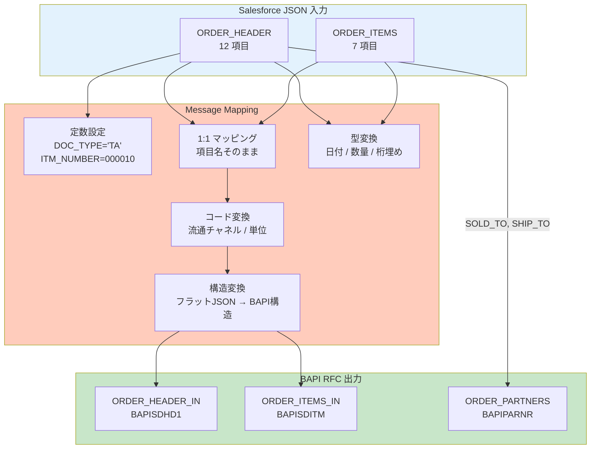

# BTP Message Mapping 設定書 — 受注伝票登録 I/F

| 項目 | 内容 |
|------|------|
| **Mapping ID** | MAP_SALESORDER_CREATE |
| **I/F ID** | IF-SD-001 |
| **作成日** | 2026-07-25 |
| **作成方法** | AI自動生成（Claude Code）→ SE レビュー済み（PoC） |
| **入力形式** | JSON（Salesforce REST API）→ XML 変換後 |
| **出力形式** | BAPI_SALESORDER_CREATEFROMDAT2 RFC 構造 |
| **バージョン** | 1.0 |

---

## 1. マッピング全体構成



---

## 2. ヘッダマッピング（ORDER_HEADER_IN）

### 2.1 1:1 直接マッピング

| Salesforce項目 | BAPI項目 | 変換 |
|---------------|---------|------|
| SALES_ORG | ORDER_HEADER_IN-SALES_ORG | そのまま転記 |
| DIVISION | ORDER_HEADER_IN-DIVISION | そのまま転記 |
| SALES_OFFICE | ORDER_HEADER_IN-SALES_OFFICE | そのまま転記 |
| PURCH_NO | ORDER_HEADER_IN-PURCH_NO_C | そのまま転記 |
| ORDER_NUMBER | ORDER_HEADER_IN | BAPI標準では未使用（EXT_REFとして扱う） |

### 2.2 型変換マッピング

| Salesforce項目 | Salesforce型 | BAPI項目 | SAP型 | 変換関数 |
|---------------|-------------|---------|------|---------|
| PURCH_DATE | "2026-07-25" (String) | PURCH_DATE | DATS(8) | `ReplaceAll(purc_date, "-", "")` → "20260725" |
| REQ_DATE | "2026-08-15" (String) | REQ_DATE_H | DATS(8) | `ReplaceAll(req_date, "-", "")` → "20260815" |
| DOC_DATE | "2026-07-25" (String) | DOC_DATE | DATS(8) | `ReplaceAll(doc_date, "-", "")` → "20260725" |
| CURRENCY | "JPY" (String) | CURRENCY | CUKY(5) | そのまま転記（ISO 4217 互換） |

### 2.3 定数設定

| BAPI項目 | 固定値 | 理由 |
|---------|-------|------|
| ORDER_HEADER_IN-DOC_TYPE | `TA` | 標準受注伝票タイプ |
| ORDER_HEADER_IN-SALES_ORG | Salesforce値 | Salesforce側の販売組織コードを使用 |
| ORDER_HEADER_IN-REF_1 | `SALESFORCE` | ソースシステム識別用 |

---

## 3. コード変換マッピング

### 3.1 流通チャネル変換 (DISTR_CHAN)

| 入力（Salesforce） | 判定ロジック | 出力（SAP） |
|------------------|------------|-----------|
| `direct` | EQUALS | `10` |
| `retail` | EQUALS | `20` |
| `wholesale` | EQUALS | `30` |
| その他 | DEFAULT | `10`（直販として扱う） |

**CPI 変換関数**: `ValueMapping("SALESFORCE_DISTR_CHAN_TO_SAP", DISTR_CHAN)`

### 3.2 数量単位変換 (UNIT)

| 入力（Salesforce/ISO） | 出力（SAP） |
|----------------------|-----------|
| PCE | PC |
| KGM | KG |
| LTR | L |
| MTR | M |

**CPI 変換関数**: `ValueMapping("ISO_UNIT_TO_SAP", UNIT)`

---

## 4. 明細マッピング（ORDER_ITEMS_IN）

### 4.1 明細変換

| Salesforce項目 | BAPI項目 | 変換 |
|---------------|---------|------|
| MATERIAL | ORDER_ITEMS_IN-MATERIAL | 上位桁ゼロ埋め: `PadLeft(MATERIAL, 18, '0')` |
| PLANT | ORDER_ITEMS_IN-PLANT | そのまま転記 |
| STGE_LOC | ORDER_ITEMS_IN-STORE_LOC | そのまま転記 |

### 4.2 数量型変換

| Salesforce項目 | Salesforce値 | BAPI項目 | 変換 |
|---------------|-------------|---------|------|
| QUANTITY | "100.000" (String) | TARGET_QTY (QUAN 13,3) | `ParseDecimal(QUANTITY)` → 100.000 |
| UNIT | "PC" | SALES_UNIT (UNIT 3) | 単位コード変換後、転記 |

### 4.3 価格マッピング（条件テーブル）

| Salesforce項目 | BAPI構造 | 変換 |
|---------------|---------|------|
| NET_PRICE | ORDER_CONDITIONS_IN | COND_TYPE=`PR00`, COND_VALUE=NET_PRICE, CURRENCY=通貨コード |

### 4.4 明細番号自動付番

| ルール | 値 |
|--------|-----|
| 1明細目 | `000010` |
| 2明細目 | `000020` |
| N明細目 | `(N * 10)`.PadLeft(6, '0') |

---

## 5. パートナーマッピング（ORDER_PARTNERS）

| Salesforce項目 | PARTN_ROLE | BAPI項目 | 説明 |
|---------------|-----------|---------|------|
| SOLD_TO | `AG` | ORDER_PARTNERS-PARTN_NUMB | 受注先（Sold-to Party） |
| SHIP_TO | `WE` | ORDER_PARTNERS-PARTN_NUMB | 出荷先（Ship-to Party） |

---

## 6. CPI Groovy Script (拡張ロジック)

```groovy
import com.sap.gateway.ip.core.customdev.util.Message

def Message processData(Message message) {
    def body = message.getBody(java.io.Reader)
    def json = new groovy.json.JsonSlurper().parse(body)
    def xml = new groovy.xml.StreamingMarkupBuilder()

    // 日付変換: ISO → SAP DATS
    def convertDate = { isoDate ->
        return isoDate?.replaceAll('-', '')
    }

    // 流通チャネルコード変換
    def convertDistrChan = { sfChan ->
        def map = [direct:'10', retail:'20', wholesale:'30']
        return map.get(sfChan, '10')
    }

    // 品目コード上位桁ゼロ埋め
    def padMaterial = { matnr ->
        return matnr?.padLeft(18, '0')
    }

    // 明細番号自動付番
    def items = json.ORDER_ITEMS
    items.eachWithIndex { item, idx ->
        item.ITM_NUMBER = String.format('%06d', (idx + 1) * 10)
        item.MATERIAL = padMaterial(item.MATERIAL)
    }

    // 日付項目変換
    json.PURCH_DATE = convertDate(json.PURCH_DATE)
    json.REQ_DATE = convertDate(json.REQ_DATE)
    json.DOC_DATE = convertDate(json.DOC_DATE)

    // コード変換
    json.DISTR_CHAN = convertDistrChan(json.DISTR_CHAN)

    // 定数設定
    json.DOC_TYPE = 'TA'

    message.setBody(json)
    return message
}
```

---

## 7. Value Mapping 登録（CPI）

```
1. CPI Monitor → Manage Value Mappings

2. Value Mapping Group: "SALESFORCE_DISTR_CHAN_TO_SAP"
   追加:
   - Agency: SF_SALES, Identifier: direct  → SAP Identifier: 10
   - Agency: SF_SALES, Identifier: retail  → SAP Identifier: 20
   - Agency: SF_SALES, Identifier: wholesale → SAP Identifier: 30

3. Value Mapping Group: "ISO_UNIT_TO_SAP"
   追加:
   - Agency: ISO_UNIT, Identifier: PCE → SAP Identifier: PC
   - Agency: ISO_UNIT, Identifier: KGM → SAP Identifier: KG
   - Agency: ISO_UNIT, Identifier: LTR → SAP Identifier: L
```

---

## 8. マッピングテスト

| # | 入力値 | 期待出力 | 確認方法 |
|---|-------|---------|---------|
| 1 | PURCH_DATE = "2026-07-25" | PURCH_DATE = "20260725" | CPI Mapping Test で確認 |
| 2 | DISTR_CHAN = "retail" | DISTR_CHAN = "20" | Value Mapping シミュレーション |
| 3 | MATERIAL = "MAT-0001" | MATERIAL = "00000000000MAT-0001" | PadLeft 確認 |
| 4 | QUANTITY = "100.000" | TARGET_QTY = 100.000 (Decimal) | ParseDecimal 確認 |
| 5 | 2明細の JSON | ITM_NUMBER=000010, 000020 | Groovy Script デバッグ |

---

## 9. 承認

| 役割 | 氏名 | 日付 | 署名 |
|------|------|------|------|
| SE（マッピング設計） | [要記入] | [要記入] | [署名] |
| SE（レビュー承認） | [要記入] | 2026-07-25 | [電子署名] |

---

*本文書は AI（Claude Code）により自動生成され、SEのレビュー・承認を経ています。*
*PoC評価用サンプル — CPI環境での実機検証が必要です。*
